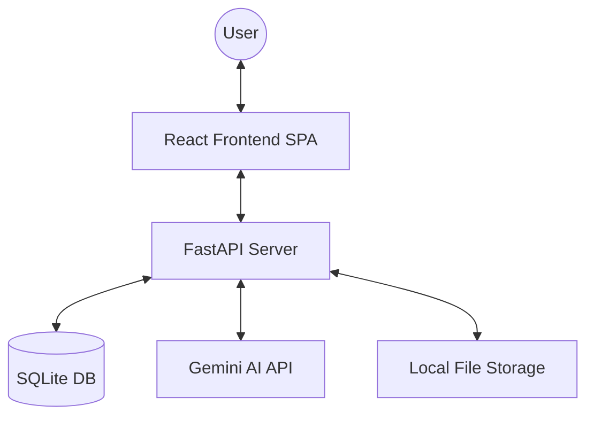

# System Architecture 🏗️

LexiSure AI is built as a robust, scalable platform using modern web technologies and state-of-the-art AI. This document outlines the technical design and data flow of the application.

## 📐 High-Level Overview

---

## 🛠️ Components

### 1. Frontend (React SPA)
-   **Routing**: Handled by `react-router-dom` for seamless navigation.
-   **State Management**: Context API (`AuthContext`) for authentication and user state.
-   **UI Components**: Built with Tailwind CSS for high performance and responsiveness.
-   **API Client**: Axios is used to communicate with the backend, with interceptors for JWT management.

### 2. Backend (FastAPI)
-   **API Endpoints**: RESTful endpoints organized into routers (`auth`, `contracts`, `analysis`, etc.).
-   **ORM**: SQLAlchemy with an asynchronous-capable setup (though using SQLite for simplicity in this version).
-   **Security**: JWT-based authentication with password hashing using `bcrypt`.
-   **Dependency Injection**: FastAPI's DI system is used for database sessions and configuration management.

### 3. AI & Analysis Layer
-   **Extraction Service**: Parses PDF and DOCX files into structured text.
-   **Gemini Service**: Orchestrates calls to Google's Gemini Pro model for:
    -   Clause identification.
    -   Risk scoring.
    -   Negotiation suggestions.
    -   Compliance checks.
-   **RAG (Retrieval-Augmented Generation)**: (Planned/Integrated) Using contract templates or knowledge bases to provide context-aware answers.

### 4. Data Storage
-   **Relational Data**: SQLite is used to store user profiles, contract metadata, and analysis results.
-   **Unstructured Data**: Uploaded contract files are stored in a secure local directory (`uploads/`).

---

## 🔄 Core Data Flow: Contract Analysis

1.  **Upload**: User selects a file in the React UI.
2.  **Transmission**: The file is sent via `multipart/form-data` to the `/contracts/upload` endpoint.
3.  **Persistence**: Backend saves the file and records metadata in the DB.
4.  **Processing**:
    -   Text is extracted from the file.
    -   The text is sent to the **Gemini Service** with a specialized legal analysis prompt.
5.  **Intelligence**: Gemini returns a JSON-formatted risk assessment.
6.  **Presentation**: Backend serves the analysis results to the Frontend, which renders interactive charts and detailed clause breakdowns.

---

## 🔒 Security Measures
-   **Authentication**: Secure login/signup with hashed passwords.
-   **Authorization**: Every contract-related endpoint checks for user ownership before allowing access.
-   **CORS**: Configured to only allow requests from the trusted frontend origin.
-   **Environment Variables**: Sensitive keys (Gemini API Key, Secret Keys) are managed via `.env` and never committed to version control.
